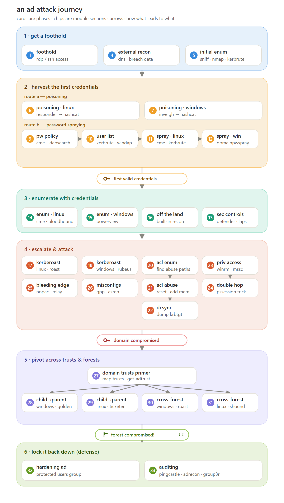

# active/ — Condensed AD attack playbook

A **map-reduce** condensation of the two AD note sets — [`../htbad/`](../htbad/README.md) (HTB
"AD Enumeration & Attacks") and [`../offad/`](../offad/README.md) (OffSec PEN-200 Modules 22–24) —
collapsed into **4 phase files**. Redundant commands are dropped; useful linux/windows variants of
the same technique are kept side by side.

Phases follow steps **1–4** of the attack journey map:

| # | File | Phase | You have… → you get… |
|---|------|-------|----------------------|
| 1 | [1-foothold.md](1-foothold.md) | **get a foothold** | nothing → initial position + pre-cred domain recon |
| 2 | [2-harvest.md](2-harvest.md) | **harvest first creds** | a foothold → first valid credentials (poisoning / spraying) |
| 3 | [3-enumerate.md](3-enumerate.md) | **enumerate with creds** | creds → full domain map + the path to DA |
| 4 | [4-escalate.md](4-escalate.md) | **escalate & attack** | a path → Domain Admin / domain compromise |

Phases **5 (trusts/forests)** and **6 (defense)** of the map are out of scope here — see the
per-section files in `htbad/` (27–33) and `offad/`.

## Conventions

- `{{VAR}}` placeholders are the same ones used across the repo, filled by
  [WorkflowHelper.html](../WorkflowHelper.html). `{{SID}}` is filled by hand.
- Commands are kept; terminal output is omitted. Linux and Windows variants of a technique are both
  retained when each is independently useful.
- These are a **quick-reference distillation** — the full lessons (theory, output, gotchas) live in
  the numbered source files under `htbad/` and `offad/`.
